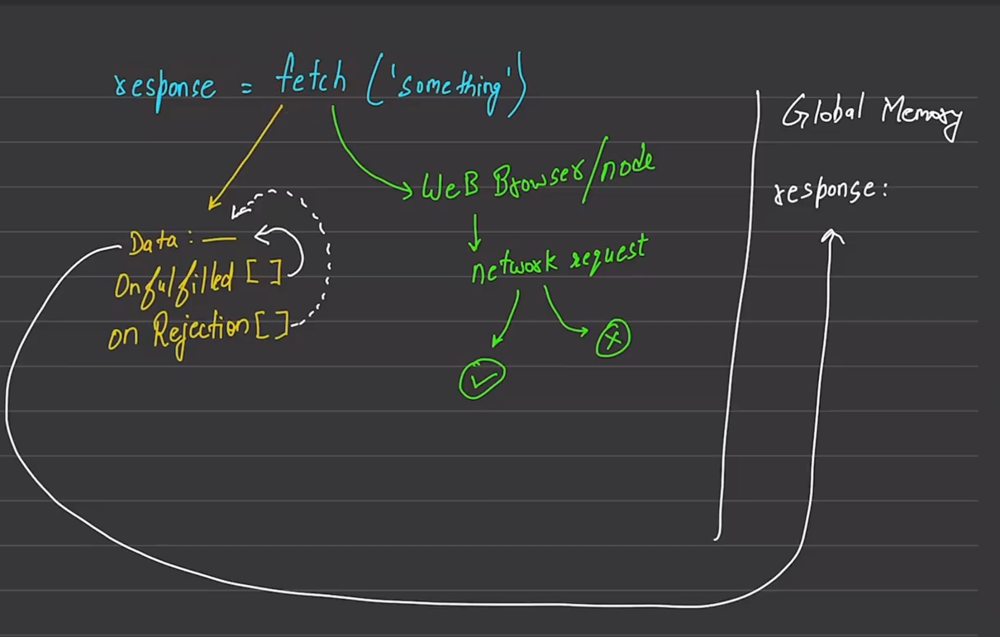

# Fetch 

When we use fetch method it do 2 tasks :first create private data field and onfulfiled[] and onRejection[] array
Second: through web browers/node send newtwork request , which is either fulfiled or rejected
on fulfiled it fills the fulfilled array else in rejection filled rejction array after this , fulfilled or rejction array is resposinble for data field after data filled it sends to global memoey for respone in this way we get respnonse from fetch

- Error 404 and other this type of error occurs when request is fulfilled not on rejection of request